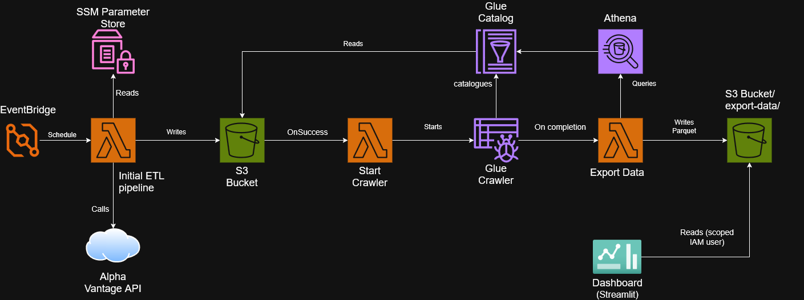

# stock-market-etl-pipeline

A serverless, fully event-driven ETL pipeline and dashboard for daily stock market data (IBM, AAPL, MSFT), built on AWS (SAM, Lambda, EventBridge, S3, Glue, Athena) with a Streamlit front end.

The pipeline fetches daily time series data from the Alpha Vantage API, flags significant price movements against a threshold, and writes the enriched data to S3 using Hive-style partitioning. From there, a fully event-driven chain of Lambdas catalogs the data via Glue, transforms it into a queryable Parquet export via Athena, and feeds an interactive Streamlit dashboard — with no fixed-time assumptions beyond the pipeline's initial daily trigger.

Built as a portfolio project to demonstrate practical AWS serverless architecture and data engineering fundamentals.

**Status**: Complete. Tiers 1–3 deployed: a fully event-driven serverless ETL pipeline with an interactive dashboard. [Live Dashboard](https://stock-market-etl-dashboard.streamlit.app/)

## Architecture 



The pipeline follows an EtLT pattern. It has a lightweight transform at ingestion, followed by a full transform once the day's data is catalogued, orchestrated entirely through events, with no fixed-time assumptions beyond the single scheduled starting point.

**Extract**: An EventBridge schedule triggers the pipeline once daily, fetching time series data for tracked equities from the Alpha Vantage API, with the API key retrieved securely from SSM Parameter Store.

**t (light transform)**: Each day's record is enriched with a computed percentage change and significance flag, and its field names are cleaned for downstream queryability, before being written to S3 as a single, immutable, Hive-partitioned file.

**Load**: The enriched record is written to S3, partitioned by `symbol=/year=/month=/day=`.

**Catalogue**: On the pipeline's success, a Lambda destination triggers a second Lambda that starts a Glue Crawler, which discovers new partitions and registers them against an explicitly-defined Glue Table (not a Crawler-managed schema, to preserve clean column names).

**T (full transform)**: The Crawler's completion event triggers a third Lambda, which runs a CTAS query against the catalogued data, producing a new, immutable, date-stamped Parquet export (a dashboard-ready "gold layer," distinct from the raw per-day records).

**Serve**: A Streamlit dashboard, using narrowly-scoped, read-only credentials, reads the most recent export directly from S3 and renders it as an interactive, filterable interface.

Every stage beyond the initial schedule is triggered by the actual completion of the stage before it, not a fixed time delay. This removes time-assumption bugs a purely schedule-based pipeline would be prone to.

## Setup

### Core pipeline

```bash
# clone the repo 
git clone <repo_url>
cd stock-market-etl-pipeline

# Install Python dependencies (local testing)
python -m pip install -r fetch_stock_data/requirements.txt
python -m pip install boto3

# Configure AWS credentials 
aws configure 

# Store your Alpha Vantage API key securely in SSM Parameter Store
aws ssm put-parameter \
  --name "/alphavantage-api-key" \
  --value "YOUR_API_KEY_HERE" \
  --type "SecureString"

# Validate SAM template 
sam validate 

# Build the application  
sam build 

# Deploy (first time, guided) - requires both capabilities, since this stack creates an explicitly-named IAM user (StreamlitReadOnlyUser)
sam deploy --guided --capabilities CAPABILITY_IAM CAPABILITY_NAMED_IAM
```

```bash
# Set environment variables for local testing of core pipeline
export STOCK_SYMBOLS="IBM,AAPL,MSFT"
export BUCKET_NAME="stock-market-etl-data-<your-account-id>"

# Set environment variables for local testing of the export/crawler Lambdas
export ATHENA_WORKGROUP="stock-data-workgroup"
export GLUE_DATABASE="stock_market_etl_db"
export CRAWLER_NAME="stock-data-crawler"
```

### Historical backfill (optional, one-time)

```bash
python scripts/backfill.py
```

### Dashboard (local development)

```bash
# Install dashboard-specific dependencies
python -m pip install -r dashboard/requirements.txt
```

Create `dashboard/.streamlit/secrets.toml` (gitignored, never committed) with:

```toml
AWS_ACCESS_KEY_ID = "your-scoped-reader-access-key-id"
AWS_SECRET_ACCESS_KEY = "your-scoped-reader-secret-access-key"
BUCKET_NAME = "stock-market-etl-data-<your-account-id>"
```

These credentials belong to a dedicated, narrowly-scoped IAM user (`StreamlitReadOnlyUser`, created by the stack) with read-only access limited to the `dashboard-export/` prefix — never your AWS admin credentials.

```bash
streamlit run dashboard/streamlit_app.py
```

## Design

This pipeline follows an EtLT pattern: a lightweight transform at ingestion, and a second, full transform once the day's data is catalogued, producing a dashboard-ready serving layer. The pipeline and the Streamlit dashboard are loosely, not fully, coupled, so the pipeline has no knowledge of Streamlit or how its output is consumed, and the transport mechanism (export -> Parquet -> read) would work unchanged for a differently-shaped dataset. The dashboard's specific views remain coupled to this dataset's actual columns, so full reusability would require a schema-agnostic dashboard, which was out of scope here.

### Data/pipeline design

**3% significance threshold**

This threshold was chosen empirically rather than assumed. After deciding to tag (not filter) the daily data with a percentage change flag, I tested 2% and 3% cutoffs against real historical data for all three symbols tracked by default. At 2%, IBM alone flagged 35% of days, which was too broad to signal genuine volatility. At 3% all three symbols landed in a tighter more consistent 6-22% range, giving more meaningful "notable day" signalling across the board.

**Tag/annotate over filter**

Rather than filtering out the non-significant days, every fetched record is tagged in place with its computed percentage change and significance flag, preserving the full raw dataset. Filtering would permanently lose the ability to answer questions like "show me every day's price" or "recompute volatility with a different threshold" later, since discarded data can't be recovered retroactively. Tagging keeps that flexibility, future analysis, dashboards or Athena query can filter at query time however it needs. 

**Latest-day-only tagging, not full history**

Only the most recent day's record is tagged on each run, rather than recomputing percentage change across the full ~100-day history returned by Alpha Vantage each call. Historical days don't change, so retagging them daily would be a redundant computation with no new information gained. This does mean historical data sits untagged until a deliberate backfill step is run. A conscious tradeoff and a planned future improvement.

**One-file-per-day restructuring**

Originally, `write_to_s3` wrote the entire ~100-day Alpha Vantage response into a single file, meaning every day's partition redundantly contained all other day's data that didn't belong to it. This broke the correctness of the partition based querying (queries for a specific date would find that date duplicated across dozens of files, not clearly isolated in its own partition). `write to s3` and `apply_threshold` were changed so each S3 object holds exactly one day's record.

**Immediate backfill over deferred backfill**

The original roadmap deferred backfill as a future improvement, assuming raw historical data would already be sitting in the S3 bucket to reprocess later. The one-file-per-day restructuring removed that assumption (only the newest day is written, so a dashboard built on a few days of accumulated history wouldn't show anything meaningful). Backfill was moved from "deferred" to immediate: a one-time script (`scripts/backfill.py`, separate from lambda handler) fetches full history once per symbol and writes every day individually, giving the pipeline ~100 days of real, dashboard-ready history from day one rather than accumulating slowly. 

**Field-name cleaning in Transform, not Load**

Alpha Vantage's raw field names (`"1. open"`, `"2. high"`, etc.) are awkward, non-SQL-friendly identifiers. Rather than handling this in `write_to_s3`, renaming happens in `apply_threshold`, alongside the existing enrichment logic. This makes it a legitimate "Transform" step. `apply_threshold` builds a fresh, clean and enriched dict in its final, queryable form.

**Immutable versioned Parquet exports (CTAS)**

CTAS cannot be rerun against the same output location, it requires the target to be empty, and fails outright on a rerun rather than overwriting. Rather than working around this with a delete-then-recreate step, each day's export is written to its own date-stamped table and S3 location. This works *with* CTAS's constraints rather than against them, and gives a free historical audit trail of every day's dashboard-ready snapshot as a side effect.

**Volatility as standard deviation**

Total Volatility is computed as the standard deviation of daily `pct_change`, not the average magnitude of daily moves. A stock moving a steady +2% every day would show near-zero volatility by this measure, despite meaningful daily movement, because standard deviation measures variability around the mean, not the size of moves themselves, which is the more standard, correct definition of volatility in practice.

**20-day moving average**

20 trading days is the standard "monthly" moving average period in real financial analysis. Given the ~100-day dataset, this costs roughly the first fifth of the chart as warm-up (no average until 20 days of data exist), a tradeoff accepted in favor of using a widely-recognized, explainable period over one purely optimized for this dataset's limited size.

### Infrastructure/AWS design

**Hive-style partitioning, `symbol=` before `year=/month=/day=`**

Data is partitioned in Hive-style partitioning with `symbol=` as the first level, rather than leading with date. This was chosen as the pipeline's primary intended access pattern, tracking each stock's full history over time (e.g. "show me all of IBM's data") rather than cross-symbol daily snapshots. The ordering also sets up efficient prefix-based querying once Glue and Athena are added, without requiring any rework of existing data.

**US equities over ASX**

US equities (IBM, AAPL, MSFT) were chosen over ASX-listed stocks primarily for better Alpha Vantage API coverage and data reliability.

**SAM template parameter for tracking symbols, not hardcoded**

Tracked symbols are defined as a SAM parameter (`FetchRequestSymbols`), not hardcoded in `app.py`. This separates configuration from the application code, changing which stocks are tracked means updating a template and redeploying, rather than tinkering with application code and retesting pipeline logic.

**Environment variables sourced, rather than duplicated**

Runtime configuration (the S3 bucket name, tracked symbols) is passed to the Lambda via environment variables sourced directly from SAM template using `!Ref`, rather than duplicated as separate hardcoded values in `app.py`. This keeps a single source of truth, if the bucket name or symbol list ever changes, it only needs to change in one place, with no risk of the template and code being out of sync. 

**Explicit Glue Table over Crawler-managed schema**

The Crawler's auto-generated table correctly inferred types but preserved Alpha Vantage's raw, awkward column names. An explicit `AWS::Glue::Table` resource was added instead, with clean column names mapped to the raw JSON keys via the SerDe's `paths` parameter. The Crawler's `SchemaChangePolicy` was set to `LOG` (not `UPDATE_IN_DATABASE`), so it continues discovering new daily partitions automatically without ever overwriting the explicit schema on a future recrawl.

**Glue Crawler over partition projection**

Partition projection (calculating valid partitions mathematically) is more current AWS-recommended pattern for a predictably-growing daily partition scheme like this one. It was considered but deferred in favour of a Crawler, given the added CloudFormation complexity and risk of a subtle, hard to debug misconfiguration. The Crawler is scheduled daily, an hour after the pipeline's own run, to pick up each new partition.

**Athena Workgroup**

Unlike Lambda, S3, and SSM Parameter Store, AWS Glue Crawlers and Athena queries are not covered by an always-free tier. They're pay-as-you-go from the first run. At this project's data volume, the actual cost is a negligible fraction of a cent, but it's acknowledged to differ from the otherwise free-tier architecture.

**Fully event driven three-stage orchestration**

The Crawler originally ran on a fixed schedule, assuming the main pipeline had already finished, the same fragile timing assumption already identified and fixed once between the Crawler and the export step. Rather than leaving one link in the chain still schedule-based, a third Lambda was added to close the gap: `FetchStockDataFunction`'s Lambda destination triggers it on success, and it starts the Crawler directly, whose own completion event triggers the export Lambda. Only the pipeline's initial trigger remains time-based, since it's the one stage with no upstream event to react to; every downstream stage reacts to the actual completion of the stage before it.

**Narrowly scoped Streamlit IAM user + secrets management**

The dashboard reads from S3 using a dedicated IAM user (`StreamlitReadOnlyUser`) granted only `s3:GetObject` and `s3:ListBucket`, both restricted to the `dashboard-export/` prefix specifically, no access to raw pipeline data, no write access, and no broad or ambient credentials in a publicly-deployed app. Credentials are stored in Streamlit's secrets management, never committed to the repository; the access key was retrieved once via a temporary CloudFormation output, then removed.

### Error handling design 

**Per-symbol try/except, continue-on-failure loop**

Each symbol is fetched, transformed, and written inside its own `try`/`except` block, so one symbol's failure doesn't halt the entire run. This was validated for real during testing. One symbol can be rate-limited mid run and the others will still succeed and write to the bucket normally.

**Explicit validation for Alpha Vantage's "200 OK with error body" behaviour**

Alpha Vantage returns HTTP 200 even when rate-limited, with the actual error embedded in the JSON body instead of the status code, a failure mode standard `raise_for_status()` checks don't catch. This was discovered directly during testing, not from documentation, and required an explicit check for the expected `"Time Series (Daily)"` key, raising a proper exception when it's missing, so the failure surfaces through the same error-handling path as any other.

**Exceptions allowed to propagate with specific types**

`fetch_stock_data` doesn't catch its own exceptions, it lets specific types (`ConnectionError`, `HTTPError`, `JSONDecodeError`, etc.) propagate up to the caller rather than collapsing everything into a generic failure or a `None` return. This was a deliberate choice: a future retry wrapper needs to distinguish a transient network blip (worth retrying) from a bad API key, and that distinction is lost the moment errors get swallowed at the source

**Retry logic with exponential backoff**

Alpha Vantage's rate-limiting had daily quotas that can be exhausted mid build. `fetch_stock_data` already kept specific exception types (`ConnectionError`, `Timeout`, `HTTPError`, and a custom rate-limit `RequestException`) propagate cleanly rather than swallowing them, specifically so a wrapper could react intelligently rather than retrying blindly. `fetch_with_retry` retries only `ConnectionError`/`Timeout` (transient network failures) up to twice, with an exponential backoff (2s, then 4s). `HTTPError` and the rate-limit exceptions propagate immediately, unretried. 

**Field validation before writing to S3**

The existing rate-limit check only validated that the response contained `"Time Series (Daily)"` key. `fetch_stock_data` now also confirms that the most recent day's record contains all five required fields (open/high/low/close/volume) and that each value is genuinely numeric, raising a descriptive `RequestException` if not. Scoped to the most recent day only, consistent with the pipeline's latest-day-only philosophy elsewhere; full historical validation was addressed directly by the backfill script re-fetching and reprocessing every day from source, rather than needing separate retroactive validation logic.

**Production bug: dotted JSON keys and Glue SerDe**

After deploying the Glue table with clean column names, Athena queries returned populated values for `pct_change`/`significant_move` but empty values for every raw field (`open`, `high`, `low`, `close`, `volume`). The root cause: Alpha Vantage's raw keys contain literal periods (`"1. open"`), which the JSON SerDe's `paths` mapping appears to interpret as a nested-field separator rather than a literal key, silently failing the lookup. Rather than working around the SerDe's handling of dotted keys, the fix was to stop writing dotted keys to S3 at all, cleaning field names during Transform.

### Dashboard design 

**Streamlit over traditional BI platforms (Tableau, Power BI, Metabase)**

Considered a traditional BI platform for the final dashboard layer (Metabase specifically given its free, self-hosting option). BI platforms would model a more realistic hand off point of a queryable tool to non-technical stakeholders. Streamlit was chosen instead for this stage: it demonstrates full end-to-end technical ownership (building the interface, not just using a platform) and produces a freely hosted, instantly interactable link for a resume. The BI-handoff reasoning remains a deliberate tradeoff worth revisiting for future portfolio work.

**KDE vs plain histogram**

A Kernel Density Estimate treats each data point as the center of a smooth "bump," summing them into one continuous curve, avoiding the arbitrary bin-boundary artifacts of a plain histogram. For a real, unimodal, roughly-bell-shaped distribution of daily returns like this dataset's, KDE reveals the underlying shape of the return distribution more clearly than blocky bins alone, this is genuinely useful, since the shape (not just volatility) of a stock's return distribution is a real, meaningful financial question.

### Monitoring design 

**CloudWatch alarm over DLQ**

The first production deploy silently failed for two days: `sam deploy --guided` hadn't correctly bundled the `requests` dependency into the deployment package, so every scheduled invocation failed with `Runtime.ImportModuleError` before any application code ran. Nothing surfaced automatically (it was only caught by manually checking S3). Fixed by running `sam build` explicitly before deployment, rather than relying on the guided deploy to handle it. This incident is the concrete motivation behind the alarm below.

A CloudWatch alarm was chosen over a Dead Letter Queue for monitoring failed runs. A DLQ only captures fully failed Lambda invocations, but the pipeline's per-symbol `try`/`except` already catches and logs individual failures (e.g. a rate-limited symbol) without crashing the whole run, so the most likely failure mode never reaches "total invocation failure". A CloudWatch alarm watching for `error`-level log entries covers both that partial-failure case and genuinely unexpected crashes, making it the broader, more useful choice given the pipeline's existing error handling. 

## Improvements / Roadmap

### Planned: 

**Partition projection**

Considered over the current Crawler-based partition discovery for its lower ongoing cost and more current AWS-recommended pattern; deferred for the Crawler's simpler, lower-risk CloudFormation given project timeline constraints. See Design Decisions.